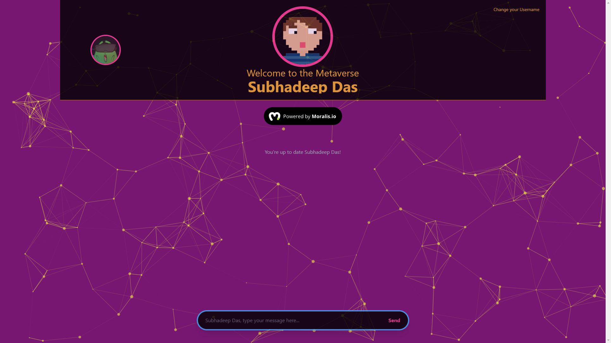

# Decentralized chatting application using Next JS and Tailwind-CSS, using the Moralis.io to access a test chain of the Ethereum blockchain and storage using Moralis realtime database:-

This is a decentralized chatting application. It has been developed using Next JS and has been styled using Tailwind-CSS. Moralis.io has been used to access a "Test chain" of the Ethereum blockchain, and the Moralis database feature has been used to store the messages. This app was my introduction to the world of Web 3.0. I do plan to use Web 3.0 technologies more in the future.

# What i learnt in this project:-
1) Better understandin of web development using Next JS and Tailwind.
2) Implementing Moralis.io to sign in using Metamask account.
3) Implementing Moralis.io to use the test chain of the Ethereum blockchain.
4) Working with the realtime database provided by Moralis.
5) Use of Dicebear avatar API.  


# Live version of the app:- [Link](https://decentralized-chat-app-subhadeep-das.vercel.app/)

## Note:- Please do log out of the app before exiting. To Log out simply click on the avatar above your name !!!

# Screenshots of the app:-
<p><b>Landing/Login Page:-</b></p>

<p><b>Main Chat Page:-</b></p>



# Next.js + Tailwind CSS Example

This example shows how to use [Tailwind CSS](https://tailwindcss.com/) [(v3.0)](https://tailwindcss.com/blog/tailwindcss-v3) with Next.js. It follows the steps outlined in the official [Tailwind docs](https://tailwindcss.com/docs/guides/nextjs).

## Preview

Preview the example live on [StackBlitz](http://stackblitz.com/):

[](https://stackblitz.com/github/vercel/next.js/tree/canary/examples/with-tailwindcss)

## Deploy your own

Deploy the example using [Vercel](https://vercel.com?utm_source=github&utm_medium=readme&utm_campaign=next-example):

[](https://vercel.com/new/git/external?repository-url=https://github.com/vercel/next.js/tree/canary/examples/with-tailwindcss&project-name=with-tailwindcss&repository-name=with-tailwindcss)

## How to use

Execute [`create-next-app`](https://github.com/vercel/next.js/tree/canary/packages/create-next-app) with [npm](https://docs.npmjs.com/cli/init) or [Yarn](https://yarnpkg.com/lang/en/docs/cli/create/) to bootstrap the example:

```bash
npx create-next-app --example with-tailwindcss with-tailwindcss-app
# or
yarn create next-app --example with-tailwindcss with-tailwindcss-app
```

Deploy it to the cloud with [Vercel](https://vercel.com/new?utm_source=github&utm_medium=readme&utm_campaign=next-example) ([Documentation](https://nextjs.org/docs/deployment)).
